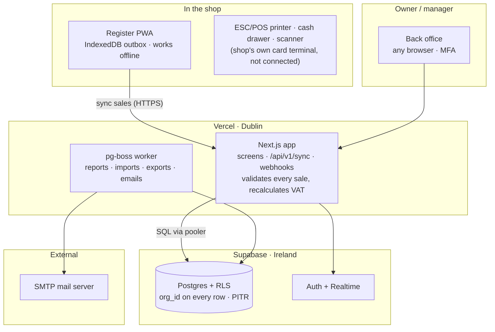

# Tillflow POS — Build Plan & System Architecture

_Version 1.0 · 29 September 2026 · Owner: M Uzair_

Tillflow POS is a cloud, offline-capable point of sale for **Irish retail shops, cafés and restaurants**, built as its own app under **tillflow.ie**. It matches Imonggo's core (checkout, inventory, customers, reports, branches) and wins on Irish VAT handling, EU data residency and no payment lock-in.

Companion file: **`TILLFLOW_POS_CLAUDE_CODE_PROMPTS.md`** — the copy-paste Claude Code prompts that implement this plan, phase by phase.

---

## 1. Decisions made

| Question                       | Decision                                                                                                                                                                                                                      |
| ------------------------------ | ----------------------------------------------------------------------------------------------------------------------------------------------------------------------------------------------------------------------------- |
| Who is v1 for?                 | Retail (general/convenience, electronics & phones, clothing & footwear), cafés (counter service) and restaurants (table service)                                                                                              |
| Card payments at the till (v1) | **No integrated card reader.** Shops use their own standalone card terminal (from their bank, SumUp, etc.); the cashier records the tender as "Card" in Tillflow. Integrated readers (Stripe Terminal / SumUp) come in **v2** |
| Login                          | Fully separate app and accounts from Tillflow Finance                                                                                                                                                                         |
| VAT set-up                     | Each shop gets its country's default VAT rates preloaded (Ireland first), stored as editable, effective-dated data                                                                                                            |
| Pricing model                  | **One fixed monthly price** for every shop (no tiers), paid by **bank transfer**; amount to be confirmed by management                                                                                                        |
| Subscription billing           | Manual invoicing + bank transfer, reconciled in the super-admin panel. **No Stripe in v1** — card/direct-debit billing is a v2 option                                                                                         |
| Stack                          | Next.js + TypeScript + Supabase Postgres (Ireland region) with Row-Level Security                                                                                                                                             |
| Hosting                        | App on Vercel (Dublin) **or** Hostinger Web Apps (EU data centre) — choose in Step 0.0; tillflow.ie landing page on Hostinger                                                                                                 |
| Build method                   | You drive Claude Code phase by phase from written specs; tests gate every merge                                                                                                                                               |
| Still open                     | Phone support owner and hours · the fixed price amount · whether the price is per shop or per business · trial length                                                                                                         |

> VAT note: preloaded rates handle the VAT your customers charge. Tillflow's own subscription invoices still need your business's VAT registration once you pass the Irish threshold — confirm with an accountant before launch.

---

## 2. Phased roadmap (one developer + Claude Code)

| Phase                                     | Weeks | Goal                                                                                                                                                                                                             | Exit gate                                                                      |
| ----------------------------------------- | ----- | ---------------------------------------------------------------------------------------------------------------------------------------------------------------------------------------------------------------- | ------------------------------------------------------------------------------ |
| **0 · Foundations**                       | 1–2   | Repo, Claude Code setup, Supabase projects, auth, RLS, CI/CD, design system, app shell                                                                                                                           | Cross-tenant RLS tests pass in CI; preview deploys work                        |
| **1 · Core register**                     | 3–7   | VAT money library, business-type onboarding, products, register PWA, cash sales, receipts, offline outbox & sync, device pairing & PINs                                                                          | A cash sale made offline syncs correctly with the right VAT                    |
| **2 · Payments, hospitality & daily ops** | 8–14  | Card tender (external terminal), split tender, refunds, shifts & Z-reports, stock ledger, customers, modifiers & allergens, tables/tabs/kitchen tickets/split bills, bulk import & filtered exports, VAT reports | A full trading day for each of the 5 business types runs end to end in staging |
| **3 · SaaS readiness**                    | 15–17 | Bank-transfer billing (invoices, payment references, mark-as-paid, reminders, pause unpaid), super-admin, emails, legal pages & GDPR tools, WCAG 2.2 AA audit, security hardening, load test, backups & runbook  | **Pilot gate:** pen test passed, offline tests lose no sales                   |
| **4 · Pilot**                             | 18–21 | 4–6 Irish sites (retail shops, a café, a restaurant) on free pilot terms; weekly fixes; accountant review of VAT reports                                                                                         | **Launch gate:** pilot sites trade 2 weeks with no data errors                 |
| **5 · Public launch, then v2**            | 22+   | Tillflow POS live on tillflow.ie at one fixed price; then (v2) integrated card readers (Stripe Terminal / SumUp), Stripe billing, multi-location, loyalty, KDS, accounting exports                               | —                                                                              |

Estimates, not promises: the gates matter more than the dates.

---

## 3. Product scope

| Module               | v1 (MVP)                                                                                                                                                                                                                                            | Later (v2+)                                                                                                         |
| -------------------- | --------------------------------------------------------------------------------------------------------------------------------------------------------------------------------------------------------------------------------------------------- | ------------------------------------------------------------------------------------------------------------------- |
| Register / checkout  | Product grid, search, barcode scan, cart, discounts, split tender (cash/card/voucher), 5c cash rounding, email or printed receipt, returns & refunds, park/recall sale, modifiers, table plan & open tabs, kitchen/bar ticket printing, split bills | Customer-facing display, self-checkout kiosk, kitchen display screens (KDS), online ordering                        |
| Products & inventory | Products, variants, categories, barcodes, VAT category per product, stock levels, low-stock alerts, Excel/CSV/JSON import & export                                                                                                                  | Suppliers & purchase orders, stock transfers, stocktakes, batch/expiry, bundles                                     |
| Cash management      | Open/close shift, float, cash in/out, X- and Z-reports, over/short                                                                                                                                                                                  | Multiple drawers per register, blind cash-up                                                                        |
| Staff                | Owner / manager / cashier roles, PIN on paired devices, per-user sales                                                                                                                                                                              | Timesheets, tip-pooling reports, custom permissions                                                                 |
| Customers            | Records, purchase history, B2B VAT number for invoices                                                                                                                                                                                              | Loyalty, store credit, gift cards, marketing lists                                                                  |
| Reports              | Daily sales, by product/category/staff, VAT by rate, payment totals, filtered export (xlsx/csv/pdf)                                                                                                                                                 | Margin & COGS, Xero/Sage/QuickBooks export, AI insights                                                             |
| Multi-location       | Single location                                                                                                                                                                                                                                     | Multiple branches, consolidated reports                                                                             |
| Integrations         | ESC/POS printers, cash drawer, USB/Bluetooth scanners; card via the shop's own standalone terminal                                                                                                                                                  | Integrated card readers (Stripe Terminal, SumUp), Shopify/WooCommerce stock sync, Tillflow Finance invoices, Peppol |
| Platform             | Sign-up, trial, bank-transfer billing & payment tracking, onboarding wizard, super-admin                                                                                                                                                            | Card / SEPA Direct Debit billing via Stripe, public API & webhooks, reseller accounts                               |

---

## 4. Business-type setup

At sign-up the owner answers four questions: business name & VAT number, **business type**, number of tills, and "import products now or start empty?". The type only switches presets on and off — every shop runs the same code and can change any setting later.

| Business type              | Product fields switched on                                             | Register behaviour                                                                          | Starter categories & reports                                   |
| -------------------------- | ---------------------------------------------------------------------- | ------------------------------------------------------------------------------------------- | -------------------------------------------------------------- |
| General / convenience      | Barcode, age-restricted flag, Re-turn deposit, bag levy item           | Scan-first screen, age-check prompt on alcohol & tobacco, 5c rounding on                    | Grocery, drinks, household, tobacco; fastest movers, low stock |
| Electronics & phones       | Serial / IMEI, warranty period, brand, model                           | Serial prompt on sale, warranty end date on receipt, serial lookup for returns              | Phones, accessories, repairs; sales by brand, serials sold     |
| Clothing & footwear        | Size × colour variant matrix, season, style code                       | Variant picker, exchange flow, gift receipts                                                | Menswear, womenswear, kids, shoes; sales by size & colour      |
| Café (counter service)     | Modifiers (size, milk, extra shot), allergens, eat-in vs take-away VAT | Quick counter screen, order name/number, bar/kitchen tickets, tips                          | Hot drinks, cold drinks, food, bakery; sales by hour, tips     |
| Restaurant (table service) | Modifiers & courses, allergens, 9% food vs 23% drinks per item         | Table plan with open tabs, send by course, split bill by item or seat, service charge, tips | Starters, mains, desserts, bar; covers, spend per cover, tips  |

Implementation: `organisations.business_type` + a `business_type_presets` config file (fields, categories, register options, dashboard tiles). Type-specific data (IMEI, warranty, modifiers, allergens) lives in a Zod-validated `attributes` JSONB column on variants, so a sixth type is a config change, not a migration.

---

## 5. Bulk import & export

**Import** (products, stock, customers, suppliers) — every plan:

1. Upload Excel (.xlsx), CSV or JSON, up to 50,000 rows; per-business-type templates.
2. Column mapping with auto-match and saved mappings; ready-made mappings for Square, Lightspeed, Imonggo and Shopify exports.
3. Validation preview: row-level errors (prices, VAT, duplicate barcodes, type-required fields), downloadable error file.
4. Create-only or create-and-update (matched by SKU or barcode).
5. Background job in batches with progress; each import has a batch ID and can be undone for 24 hours.

**No raw SQL execution.** Running a customer's SQL would bypass Row-Level Security. Shops convert dumps to CSV/Excel; a later version may parse `INSERT` rows from .sql into the same mapping screen without executing them.

**Export:** any list or report exports exactly as filtered on screen, as .xlsx, .csv or .pdf. Large exports run as background jobs and arrive by email link. A full-account ZIP export covers GDPR portability.

**Security:** customer-data exports are owner/manager only, rate-limited and audit-logged; uploads are scanned, parsed server-side and deleted after 7 days; cells starting with `= + - @` are escaped on export (formula injection).

Libraries: Papa Parse (CSV), ExcelJS (xlsx), react-pdf (PDF), `import_jobs` table.

---

## 6. Tech stack

| Layer            | Choice                                                                                       | Why                                                                      |
| ---------------- | -------------------------------------------------------------------------------------------- | ------------------------------------------------------------------------ |
| Language         | TypeScript (strict)                                                                          | Types catch AI mistakes at build time                                    |
| Web app          | Next.js (App Router) + React                                                                 | Server components for back office, client components for the register    |
| Register         | Same app as installable PWA (Serwist service worker)                                         | iPad, Android, Windows/Mac; no app store                                 |
| UI               | Tailwind CSS + shadcn/ui (Radix) + Lucide                                                    | Accessible components, easy for AI to extend                             |
| Offline storage  | IndexedDB via Dexie.js                                                                       | Local catalogue and sale outbox                                          |
| Database         | PostgreSQL on Supabase, eu-west-1 (Ireland)                                                  | RLS, PITR backups, EU residency                                          |
| ORM & migrations | Drizzle ORM + drizzle-kit                                                                    | Typed SQL, versioned migrations                                          |
| Auth             | Supabase Auth (password, magic link, TOTP MFA) + device pairing + cashier PINs               | Integrates with RLS via JWT                                              |
| Validation       | Zod, shared client/server                                                                    | One source of truth                                                      |
| Server logic     | Server actions + route handlers (`/api/v1/*`)                                                | Sync, webhooks                                                           |
| Background jobs  | pg-boss (Postgres queue in Supabase)                                                         | Reports, emails, imports/exports, retries; no extra sub-processor        |
| Rate limits      | Postgres `check_rate_limit()` (auth, exports) + in-memory (sync); PIN lockout as DB counters | No extra sub-processor or secrets                                        |
| Card payments    | None integrated in v1 — "Card" tender recorded from the shop's own terminal                  | No card data ever touches Tillflow; Stripe Terminal / SumUp in v2        |
| Subscriptions    | Manual invoices + bank transfer                                                              | Management's choice; automated card/direct-debit billing is v2           |
| Email            | Nodemailer (SMTP) + React Email                                                                     | Receipts, Z-reports, invites                                             |
| Printing         | ESC/POS via WebUSB/network or local print bridge; browser print fallback                     | Receipts, kitchen tickets, drawer kick                                   |
| Hosting          | Vercel (`dub1`) or Hostinger Web Apps (Node.js)                                              | Vercel: preview URL per PR · Hostinger: flat price, separate staging app |
| Monitoring       | Own error log (`error_events`, pino, email alerts via SMTP) + Better Stack uptime          | Errors stay in our EU database                                           |
| Testing          | Vitest, Playwright, SQL RLS tests                                                            | Safety net for AI-written code                                           |
| CI/CD            | GitHub Actions                                                                               | Lint, typecheck, test, migrate                                           |

Higgsfield: design exploration and the tillflow.ie marketing site. The POS itself lives in a GitHub repo you own.
Hostinger alternative: Docker on a Hostinger KVM VPS with Coolify, Supabase stays managed — only if cost demands it later.

---

## 7. System architecture

The register writes each sale locally first, then syncs it; the API re-checks prices and VAT before writing to Postgres. Card payments happen on the shop's own terminal; Tillflow only records that a card was used, so no card data ever reaches it.

---

## 8. Data model

Every business table carries `org_id`; RLS allows a row only when `org_id` matches the signed-in user's organisation. Money is integer cents; IDs are UUIDv7 generated on the device.

| Table                           | Key columns                                                                                                                               | Notes                                                                                    |
| ------------------------------- | ----------------------------------------------------------------------------------------------------------------------------------------- | ---------------------------------------------------------------------------------------- |
| `organisations`                 | name, legal_name, vat_number, cro_number, business_type, country, plan, trial_ends_at, status                                             | The tenant                                                                               |
| `locations`                     | org_id, name, address, eircode, timezone, receipt_footer                                                                                  | A shop                                                                                   |
| `registers`                     | location_id, name, device_token_hash, paired_at, last_seen_at                                                                             | Paired till                                                                              |
| `memberships`                   | user_id, org_id, role, pin_hash, location_ids                                                                                             | owner / manager / cashier                                                                |
| `tax_rates`                     | country, code, rate_bp, valid_from, valid_to                                                                                              | 2300 = 23%; effective-dated                                                              |
| `products` / `variants`         | sku, barcode, name, price_incl_vat, tax_category, cost, track_stock, attributes (JSONB)                                                   | VAT-inclusive prices                                                                     |
| `categories`                    | name, parent_id, colour, sort                                                                                                             | Register tiles                                                                           |
| `product_modifier_groups`       | product_id, group_id, sort                                                                                                                | Which groups a product offers                                                            |
| `modifier_groups` / `modifiers` | name, min/max choices, price_delta                                                                                                        | Cafés & restaurants                                                                      |
| `tables` / `tabs`               | floor, seats, status; tab lines, course                                                                                                   | Restaurants                                                                              |
| `stock_movements`               | variant_id, location_id, qty_delta, reason, ref_id                                                                                        | Append-only ledger                                                                       |
| `stock_levels`                  | variant_id, location_id, on_hand                                                                                                          | Cached total                                                                             |
| `customers`                     | name, email, phone, vat_number, marketing_consent_at                                                                                      | GDPR consent timestamp                                                                   |
| `sales` / `sale_lines`          | receipt_no, status, totals, idempotency_key; qty, unit_price, discount, tax_rate_bp, tax_amount                                           | Rate snapshotted on the line                                                             |
| `payments`                      | method, amount, provider_ref, tip_amount                                                                                                  | No card numbers                                                                          |
| `refunds`                       | original_sale_id, lines, reason, approved_by                                                                                              |                                                                                          |
| `shifts` / `cash_movements`     | float, counted, expected, closed_at                                                                                                       | Z-report                                                                                 |
| `import_jobs`                   | type, status, rows, errors, batch_id                                                                                                      | Undo within 24h                                                                          |
| `audit_log`                     | actor, action, entity, before, after, ip                                                                                                  | Append-only                                                                              |
| `subscriptions`                 | status (trial / active / overdue / paused), price_cents, period_start, period_end                                                         | One fixed price, paid by bank transfer                                                   |
| `billing_invoices`              | invoice_no (sequential), org_id, amount_ex_vat, vat, total, issued_at, due_at, payment_reference, paid_at, bank_reference, marked_paid_by | Your invoices to shops; paid by bank transfer, marked paid by super-admin (audit-logged) |

Rules: completed sales are never edited (refund/void rows instead) · VAT per line, half-up to the cent, rate copied onto the line · every register write has an idempotency key · records kept ≥ 6 years.

---

## 9. Offline-first sync

1. Device caches catalogue, tax rates, hashed PINs and settings in IndexedDB.
2. Checkout writes the sale to a local `outbox` (UUIDv7 + idempotency key); the receipt prints immediately.
3. A background worker posts outbox items in order to `POST /api/v1/sync/sales` when online.
4. Server validates and writes sale, lines, payments and stock movements in one transaction.
5. Device marks it synced; failures retry with backoff; genuine rejections are flagged to a manager, never dropped.
6. Catalogue changes reach devices by "changes since cursor" pulls, nudged by Supabase Realtime.

Server owns catalogue and prices; the device owns what was sold. Stock may go negative after offline trading — reported, not blocked. Status pill: Online · Offline (n waiting) · Syncing. Offline > 24 h warns the manager. Cash and card tenders both work fully offline in v1, because the card is taken on the shop's own terminal and Tillflow only records it.

---

## 10. Security

- **Tenant isolation:** RLS on every table from the first migration; CI fails if a table lacks a policy; tests prove Shop A cannot read or write Shop B.
- **Service-role / privileged DB access** only in `src/lib/ops/db.ts` (calls `ops.*` SECURITY DEFINER functions only) and the pg-boss job handlers; never in the browser. CI checks the imports.
- **Auth:** owners MFA-required; registers paired with one-time codes (revocable device tokens); cashier PINs hashed with Argon2, rate-limited, lockout after 5 failures; PIN never works on an unpaired device; manager override for refunds, big discounts and no-sale drawer opens, all audit-logged.
- **PCI DSS:** out of scope in v1 — Tillflow never handles card data. The "Card" tender stores only the amount and an optional terminal receipt reference typed by the cashier (never card numbers).
- **App:** Zod validation + role check in every server action; server recalculates all totals; CSP/HSTS/secure cookies; rate limits; secrets only in Vercel/Supabase settings; Dependabot + `npm audit`; PII scrubbing in our own error log.
- **Data:** TLS + encryption at rest; PITR; monthly restore test; append-only audit log; independent pen test before launch and yearly.
- **AI guardrails:** Claude Code never gets production credentials; RLS, auth, payments and money-maths changes need a passing test and your line-by-line review.

## 11. Scalability & reliability

Stateless app servers · Supabase connection pooler · indexes `(org_id, created_at)` and `(org_id, barcode)` · nightly/rolling `daily_sales_summary` pre-aggregation · growth path: bigger compute → read replica → monthly partitioning of `sales`/`stock_movements` → queue heavy exports · 99.9% back-office uptime target with status page · offline registers keep trading through cloud outages · environments: local → staging → production; migrations only via CI.

---

## 12. Irish compliance checklist

Not legal advice — have an Irish accountant and solicitor review before launch. Ireland currently has no fiscalised-till requirement.

| Area                    | Requirement                                                                                                                                                                                          | What Tillflow does                                                                                  |
| ----------------------- | ---------------------------------------------------------------------------------------------------------------------------------------------------------------------------------------------------- | --------------------------------------------------------------------------------------------------- |
| VAT rates               | 23% / 13.5% / 9% / 0% (+4.8% livestock). From 1 July 2026 restaurant & catering services and hairdressing moved from 13.5% to 9%; alcohol, soft drinks and bottled water stay 23%; tea and coffee 9% | Effective-dated rate rows; tax category per product; meal-deal apportionment; central rate updates  |
| Eat-in vs take-away     | Take-away food is a supply of goods; cold take-away food 0%                                                                                                                                          | Eat-in / take-away toggle for cafés & restaurants                                                   |
| Receipts & VAT invoices | Business customers can request a full VAT invoice                                                                                                                                                    | Sequential receipt numbers; "Convert to VAT invoice"                                                |
| VAT returns             | VAT3 and annual Return of Trading Details                                                                                                                                                            | VAT report by rate and period, exportable                                                           |
| Record keeping          | Keep records 6 years                                                                                                                                                                                 | 6-year retention, soft delete, archive                                                              |
| E-invoicing (ViDA)      | From Nov 2028 large corporates issue structured e-invoices; all VAT-registered businesses must be able to receive them; B2C out of scope                                                             | No till change; B2B invoices via Tillflow Finance with Peppol by 2028                               |
| GDPR / DPA 2018         | You are processor for shops' customer data; DPC regulates                                                                                                                                            | DPA in T&Cs, EU hosting, sub-processor list, export & deletion tools, consent timestamps            |
| Card payments           | PCI DSS; PSD2 SCA; consumer card surcharges banned                                                                                                                                                   | Handled by the shop's own terminal and acquirer in v1; Tillflow offers no consumer surcharge option |
| Accessibility (EAA)     | In force since 28 June 2025 (S.I. 636/2023); CCPC enforces                                                                                                                                           | WCAG 2.2 AA; mandatory for customer-facing screens and your sign-up/billing pages                   |
| Cash                    | 5c rounding common                                                                                                                                                                                   | Optional 5c rounding shown on receipt                                                               |
| Tips                    | Tips & Gratuities Act 2022: show how tips are shared                                                                                                                                                 | Tip capture + tips report                                                                           |
| Deposit Return Scheme   | Re-turn deposits on bottles & cans                                                                                                                                                                   | Deposit as separate line                                                                            |
| Levies & age            | Plastic bag levy; alcohol minimum unit pricing                                                                                                                                                       | Levy item type; age prompt; minimum-price guard                                                     |
| Consumer law            | Consumer Rights Act 2022; VAT-inclusive prices                                                                                                                                                       | Refund flows with reasons                                                                           |
| Food allergens          | Allergen info for the 14 regulated allergens on non-prepacked food (FSAI)                                                                                                                            | Allergen tags per item on register, menus, tickets, receipts                                        |

Confirmed 2026-10-05: hot take-away food and tea/coffee (on or off premises) 9%; cold take-away food 0%; alcohol, soft drinks and bottled water 23%; Re-turn deposit (15c for 150ml-500ml, 25c above 500ml up to 3L) sits outside VAT (s.92A VATCA 2010). Open: any Budget 2027 rate changes before go-live, and accountant sign-off.

---

## 13. UI/UX principles

- Goal: a new cashier completes a sale untrained within 5 minutes.
- Register: two panes (tiles/search left, cart + big Pay right), landscape tablet first (≥ 1024×768), 48×48 px touch targets, tabular numerals, total always visible, 3 taps for a common sale, scan-anywhere.
- Solid, high-contrast register surfaces; keep the liquid-glass look for back office and marketing (translucency lowers contrast and risks WCAG failures).
- Colour never the only signal; clear states for online/offline and printer.
- Back office: left nav (Dashboard, Sales, Products, Inventory, Customers, Staff, Reports, Settings); "how's today going" dashboard; onboarding checklist.
- One Tillflow design system shared with Tillflow Finance; light/dark; strings in translation files (Irish later).

---

## 14. Pricing and billing

**One fixed monthly price, paid by bank transfer.** Management has chosen a single price for every shop (no Starter/Growth/Pro tiers) and payment by bank transfer instead of card or direct debit.

| Item                | Decision                                                                                                                                         |
| ------------------- | ------------------------------------------------------------------------------------------------------------------------------------------------ |
| Price               | One fixed monthly price, ex VAT — **amount to be confirmed** (per shop or per business also to be confirmed)                                     |
| What's included     | Everything in v1: all business types, registers, staff, reports, import/export, email support                                                    |
| Trial               | Free trial before the first invoice — length to be confirmed (14 days suggested)                                                                 |
| How shops pay       | Bank transfer (SEPA credit transfer) to Tillflow's Irish business account, quoting a unique payment reference                                    |
| Invoices            | Sequential VAT invoices, issued monthly by email as PDF with IBAN/BIC and the payment reference                                                  |
| Reconciliation      | You check the bank statement and click **Mark as paid** in the super-admin panel, entering the bank reference; every action is audit-logged      |
| Late payment        | Reminder at due date, again at +7 days; account moves to **read-only** after a grace period (they can still view and export data, never deleted) |
| Card / direct debit | Not in v1. Automated billing (e.g. Stripe with card and SEPA Direct Debit) is a v2 option                                                        |

**How it flows**

1. Trial ends → an invoice is generated automatically and emailed to the owner.
2. The owner pays by bank transfer with the payment reference.
3. You match the transfer in your bank app and mark the invoice paid in super-admin.
4. Unpaid after the grace period → reminders → read-only mode until paid.

**Trade-offs to know**

- Reconciliation is manual: roughly a minute per shop per month. Fine for tens of shops, tedious at hundreds. That's the point to add automated billing in v2, or add a bank-feed import (e.g. a CSV from your bank) to auto-match references.
- Bank transfers have no automatic retry, so late payers need chasing; the automated reminders and read-only mode do most of that.
- Your own invoices must meet Irish VAT invoice rules once you're VAT-registered (your VAT number, sequential numbering, VAT rate and amount). Confirm with your accountant.

Card payments **at the till** in v1 use the shop's own standalone terminal; the cashier records the tender as "Card". Integrated readers arrive in v2.

Benchmarks for setting the price: Lightspeed ~€69–€199/month; Square free + 1.75% per card-present transaction; Imonggo premium $45/branch/month; Tillflow Finance (Invozo) is €49/month by bank transfer.

---

## 15. Risks

| Risk                                                          | Mitigation                                                                                                                                         |
| ------------------------------------------------------------- | -------------------------------------------------------------------------------------------------------------------------------------------------- |
| Cross-tenant data leak from AI-written code                   | RLS everywhere, RLS tests in CI, security plugin + reviews, pen test                                                                               |
| Offline sync loses/duplicates sales                           | Idempotency keys, outbox kept until confirmed, e2e offline tests                                                                                   |
| VAT errors                                                    | Tested money library, rates as data, accountant review                                                                                             |
| Scope creep (5 business types + hospitality)                  | Presets over custom code; strict phase gates                                                                                                       |
| Hardware variety                                              | Short certified-hardware list; recommended bundles                                                                                                 |
| Card totals typed on a separate terminal don't match the till | Card tender defaults to the exact amount due; Z-report shows card total to compare with the terminal's end-of-day report; integrated readers in v2 |
| Support load                                                  | In-app guides, onboarding checklist, no free tier                                                                                                  |
| Manual bank-transfer reconciliation and late payers           | Unique payment references, automated reminders, read-only mode after grace period; automated billing in v2 if volume demands                       |
| Competing with free (Square, SumUp)                           | Irish-first VAT, local support, no lock-in, Finance bundle                                                                                         |

## 16. Sources

- [Imonggo](https://www.imonggo.com/)
- [Sage — VAT rates in Ireland 2026](https://www.sage.com/en-ie/blog/vat-rates-in-ireland/)
- [VATupdate — Hospitality VAT cut to 9% from 1 July 2026](https://www.vatupdate.com/2026/07/18/hospitality-vat-cut-to-9-from-1-july-2026/)
- [Marosa — Ireland VAT rate changes](https://marosavat.com/vat-news/ireland-vat-rate-changes)
- [VATupdate — Ireland phased e-invoicing](https://www.vatupdate.com/2026/02/12/ireland-confirms-phased-e-invoicing-while-the-uk-weighs-a-different-path/)
- [Avalara — E-invoicing in Ireland](https://www.avalara.com/us/en/vatlive/country-guides/europe/ireland/irish-e-invoicing.html)
- [Arthur Cox — European Accessibility Act](https://www.arthurcox.com/knowledge/the-european-accessibility-act-what-you-need-to-know/)
- [WebYes — EAA in Ireland](https://www.webyes.com/blogs/eaa-ireland/)
- [Vendors.ie — Lightspeed Ireland pricing](https://vendors.ie/blog/lightspeed-pos-review-ireland)
- [Vendors.ie — POS systems Ireland 2026](https://vendors.ie/blog/pos-system-ireland)
